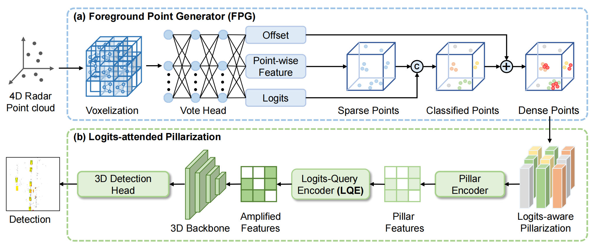
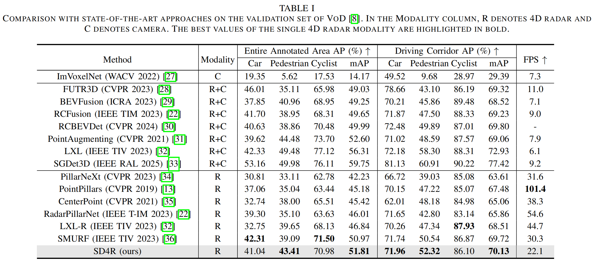
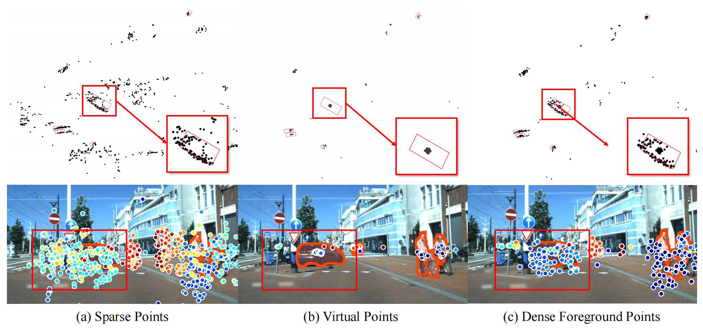

# SD4R: Sparse-to-Dense Learning for 3D Object Detection with 4D Radar.

## 🗓️ News

- **2025.7.2** ITSC acceptance

## 📜 Abstract
 
4D radar measurements offer an affordable and weather-robust solution for 3D perception. However, the inherent
sparsity and noise of radar point clouds present significant challenges for accurate 3D object detection, underscoring the
need for effective and robust point clouds densification. Despite recent progress, existing densification methods often fail to address the extreme sparsity of 4D radar point clouds and exhibit limited robustness when processing scenes with a small number of points. In this paper, we propose SD4R, a novel framework that transforms sparse radar point clouds into dense representations. SD4R begins by utilizing a foreground point generator (FPG) to mitigate noise propagation and produce densified point clouds. Subsequently, a logit-query encoder (LQE) enhances conventional pillarization, resulting in robust feature representations. Through these innovations, our SD4R demonstrates strong capability in both noise reduction and foreground point densification. Extensive experiments conducted on the publicly available View of-Delft dataset demonstrate that SD4R achieves state-of-the-art performance.

## 🛠️ Method

Architecture of our SD4R neural network.
(a)  The proposed SD4R pipeline begins with voxelization of 4D radar point cloud, followed by processing through the VoteHead. This step predicts offsets between points and their corresponding object centers, classification logits, and point-wise features. These point-wise features are then concatenated with the logits to classify the point clouds. Subsequently, virtual points are generated at positions determined by the offsets, resulting in a densified point cloud. 
(b)  The densified point cloud undergoes pillarization to extract features. To further address the sparsity of radar data, we introduce a logit-query encoder (LQE) module, which aggregates features from neighboring points into pillars, leading to more robust representations. Finally, the detection head processes these features to generate the final detection outputs.

## 🍁 Quantitative Results

## 🔥 Getting Started

step 1. Refer to [Install.md](./docs/Guidance/Install.md) to install the environment.

step 2. Refer to [dataset.md](./docs/Guidance/dataset.md) to prepare View-of-delft (VoD)

step 3. Refer to [train_and_eval.md](./docs/Guidance/train_and_eval.md) for training and evaluation.

### 😙 Acknowledgement

Many thanks to these exceptional open source projects:

- [mmdet3d](https://github.com/open-mmlab/mmdetection3d)
- [SGDet3D](https://github.com/shawnnnkb/SGDet3D)

As it is not possible to list all the projects of the reference papers. If you find we leave out your repo, please contact us and we'll update the lists.

## ✒️ Citation

If you find our work beneficial for your research, please consider citing our paper and give us a star. If you encounter any issues, please contact 2608745157@qq.com.

## 🐸 Visualization Results

Performance of our SD4R in real-scene 3D detection. The sparse points refer to the original radar measurements, while the virtual points are generated only based on the foreground points. The second row shows the corresponding visualization results. Our SD4R framework demonstrates strong capability in both noise reduction and foreground point densification.

